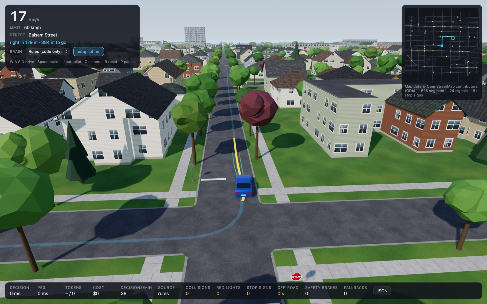
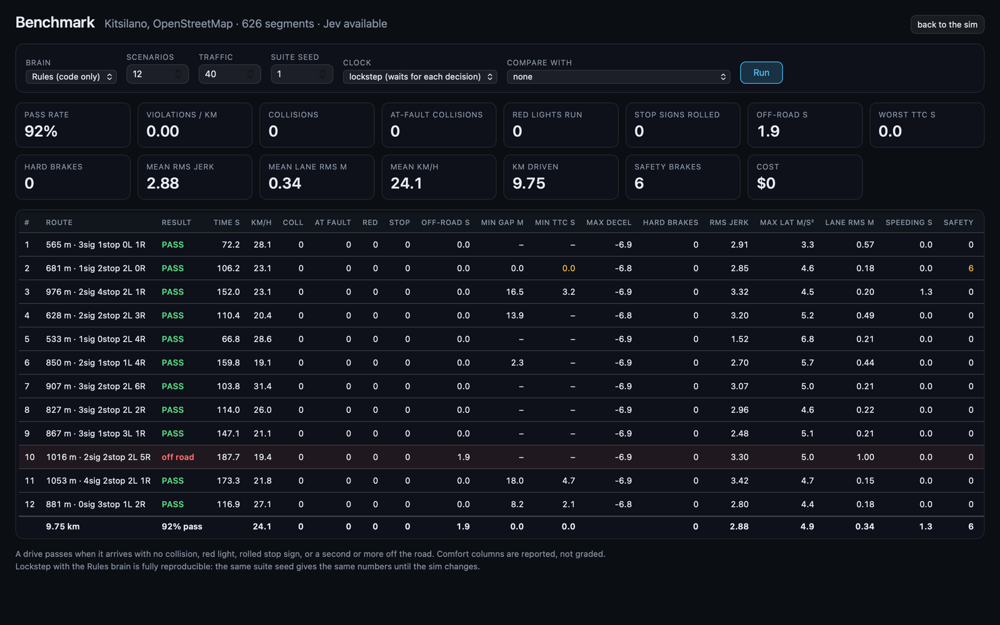

# Jev FSD

A driving simulator on real city streets where an AI model drives the car, and you can watch it
think. The model is [Jev](https://typesafe.ai/) by TypeSafe AI, a "System One" model: it does not
write text, it answers typed questions with probabilities in about a tenth of a second. Click a
destination on the minimap and Jev drives there through traffic, stop signs, and lights, while a
panel shows exactly what it was asked and how sure it was.



*The Rules brain driving in Kitsilano. Blue: the route. Green: the maneuvers that survived
simulation. Yellow: the one chosen. Every building, street, lane, signal, and stop sign comes from
OpenStreetMap.*

Default map: Kitsilano, Vancouver. Any neighbourhood works.

## Try it

You need [uv](https://docs.astral.sh/uv/) (it provides Python 3.10 or newer and the one
dependency). The 3D scene loads Three.js from a CDN, so there is no Node and no build step.

```sh
git clone https://github.com/BrendanH18/jev_fsd && cd jev_fsd
uv run server.py
```

Open http://127.0.0.1:8322 and click anywhere on the minimap.

**To let Jev drive you need a TypeSafe API key.** Jev is in early access; request one at
[console.typesafe.ai](https://console.typesafe.ai). Then:

```sh
cp .env.example .env      # put TYPESAFE_API_KEY=... in it, restart the server
```

Without a key the app still runs with the **Rules** brain, plain code that drives the same car
through the same harness. It is the fallback and the control group, not a fake Jev.

| Key | Action |
|---|---|
| click the minimap | set a destination (autopilot starts) |
| `J` | autopilot on / off |
| `W A S D` or arrows | drive yourself (takes over from the autopilot) |
| `Space` | brake hard |
| `C` | camera: chase, top-down, high chase |
| `R` | reset the car onto the nearest lane |
| `P` | pause |
| `1` / `2` | Jev brain / Rules brain |
| **JSON** | the panel: state, questions, answers, and timing for every decision |

Three pages: `/` the sim, `/bench` the benchmark, `/tests` the browser test suite.

Requirements: a desktop browser with WebGL. Phones are not supported yet.

## What is simulated

**The map.** Streets, lanes, speed limits, one-way streets, traffic signals, stop signs, and
building footprints come from OpenStreetMap and are built into a "map pack" on the server. Stop
lines sit just short of the crossing street's curb (further back at signals, to leave room for a
crosswalk), so a stopped car never waits inside the other road. Signal timing is invented (48 s
cycles), because OpenStreetMap has none.

**The car.** A kinematic bicycle model with two things real cars have and toy models lack:

- *Actuator lag.* Throttle and brakes reach the commanded acceleration through a 0.25 s lag and a
  15 m/s^3 jerk limit, so the car cannot flip from full throttle to full braking in one tick.
- *Tire grip.* Braking and cornering share one friction circle (mu 0.9, dry asphalt). Asked to
  turn tighter than the tires allow, the car understeers onto a wider arc; a turn taken too fast
  leaves the road.

The same model drives the ego car, every traffic car, and every forward simulation the planner
runs, so predictions match what actually happens.

**Traffic.** 40 cars follow lanes with the Intelligent Driver Model, pick turns at random, stop for
red lights and stop signs, wait for crossing traffic, yield to oncoming cars when turning left and
to crossing cars at junctions with no sign or signal, and signal their turns.

**The scene.** Everything is procedural, so there are no assets to download or license: a sky
with a late-afternoon sun and shadows that follow the car, textured asphalt, curbs, grass
boulevards and sidewalks, lane markings that stop at junctions, crosswalks at signals,
Vancouver-style far-side mast-arm signals whose lamps glow, octagonal stop signs, street lights on
arterials, thousands of street and yard trees, and houses with siding, windows, and gabled or
hipped roofs. Cars have glass, lights, plates, rims, brake lights that come on as they slow, and
indicators. A frame is roughly 600 draw calls and 460,000 triangles.

**Honest counters.** The HUD counts collisions, red lights run, stop signs rolled, time off the
road, safety-brake interventions, and fallbacks. Nothing is hidden or reset.

## How it decides

Jev is text-only and, by TypeSafe's own account, not a calculator. So the split is strict:
**code owns the math, Jev owns the judgment.**

Every 250 ms of sim time near anything interesting (an intersection, a car ahead, a turn) and every
650 ms on open road:

1. **Sense.** Code projects the car onto the route and computes the situation: lane offset,
   the next traffic control and its state, the car ahead and the gap, nearby traffic in the car's
   frame, and a `target_speed`: the speed limit, lowered for the car ahead, a required stop, the
   destination, and curves. The curve part is a speed profile over the next 60 m, the fastest
   speed from which the car can still slow comfortably to every point's safe cornering speed.
2. **Sample.** Code proposes up to 16 maneuvers: hold the lane at several speeds (never above the
   limit), shift half a meter or a meter left or right, roll up to the stop line, stop at the
   destination, brake hard. A maneuver's speed is a ceiling; through a turn the curve profile
   lowers it, the way a real speed controller would.
3. **Simulate.** Each maneuver runs 3 seconds forward with the real car model and controller
   against predicted traffic. Anything that collides, leaves the road, or crosses a red or an
   uncompleted stop line is rejected before Jev ever sees it.
4. **Ask.** The survivors and the situation go to Jev as one request with two questions:
   `motion` (drive or hold still, right now) and `vector` (which maneuver for the next second).
   Questions with one legal answer are answered locally and cost nothing.
5. **Execute.** The chosen maneuver keeps running until the next answer lands, so latency never
   stalls the car. A local safety brake overrides for imminent collisions only, and a stopped car
   will not pull into a car right in front of it. Neither ever intervenes for lights or signs;
   those mistakes are counted on screen, not hidden.

### What Jev actually sees

A real decision, saved from a drive (`data/snapshots/red_light.json`), trimmed:

```json
{
  "driving_style": "cautious city driver: obeys limits, stops fully at stop signs, keeps a safe gap, ...",
  "car": {"speed": 0.7, "limit": 13.9, "target_speed": 0, "target_reason": "red light", "speed_vs_target": "above target"},
  "nav": {"next_turn": "left", "turn_in_m": 313.9, "remaining_m": 414, "turn_street": "Stephens Street"},
  "road": {"name": "West Broadway", "on_road": true, "lane_position": "centered"},
  "intersection": {"control": "signal", "signal": "red", "bumper_to_line_m": 5.9, "distance": "at", "entered": false},
  "candidates": [
    {"id": "keep_lane_hold", "steer": "hold lane",          "speed": "keep 0.7",   "vs_target": "above target", "progress_m": 2.1, "outcome": "clear"},
    {"id": "keep_lane_stop", "steer": "hold lane",          "speed": "stop",       "vs_target": "at target",    "progress_m": 0.4, "outcome": "clear"},
    {"id": "left_0.5_hold",  "steer": "shift 0.5 m left",   "speed": "keep 0.7",   "vs_target": "above target", "progress_m": 2.1, "outcome": "clear"},
    {"id": "hard_brake",     "steer": "hold lane",          "speed": "brake hard", "vs_target": "at target",    "progress_m": 0.1, "outcome": "clear"}
  ],
  "rejected": {"runs_red": 3}
}
```

The three maneuvers that would have crossed the line never reached Jev; code rejected them.

The `motion` question, with the situation clauses code chose to include:

> You are the driving policy of a car in city traffic. Obey traffic controls and drive as described
> in `driving_style`. The car is at the line and the signal is red: hold still until it turns green.
> Decide whether the car should keep moving or hold still right now.
>
> **drive**: Keep moving: cruising, slowing down, or rolling up to a stop line that is not reached
> yet all count as driving. Correct whenever the line, obstacle, or destination is still ahead.
> **stop**: Hold completely still right now. Correct only when the car is already at the line with
> a red light or a stop not yet completed, when the path directly ahead is blocked, or when the car
> has reached the destination.

Jev's answer, live: `motion = stop` at 100%, `vector = keep_lane_stop` at 99%, in 100 ms, for
$0.00006. Twenty meters earlier the same questions get `drive` at 100% and `stop_at_line` at 95%.

Wording is code. When the `stop` option was described as "a stop sign not yet completed", Jev
halted 47 m before the sign and waited. Say *when* an option is correct, and it drives.

## Benchmark



http://127.0.0.1:8322/bench scores a brain on a fixed suite of drives, so any change to the car
model, the traffic, the planner, or Jev's question wording can be measured instead of eyeballed.

- **The suite** is built from a seed: start points, destinations routed by the server, and a
  traffic seed per drive. The same map and seed always give the same suite.
- **Each drive** runs headlessly through the same world, traffic, autopilot, and step function as
  the app, until it arrives or runs out of time.
- **Two clocks.** *Lockstep* pauses the sim while a decision is in flight: it measures decision
  quality alone, and for the Rules brain the numbers are identical run after run. *Realtime* lets
  the world keep moving while a request is out, as in the app, so model latency counts.
- **Runs are saved** to `data/runs/` and any two can be compared side by side (the cards show the
  change against the chosen run). **watch** on a row replays that exact drive in the 3D sim.

A drive **passes** when it arrives with no collision, no red light, no rolled stop sign, and less
than a second off the road. Everything else is reported, not graded:

| Group | Metrics |
|---|---|
| Safety | collisions and whose fault (ego: it ran into a car ahead or a stopped car; other: it was hit while stopped or from behind; shared: crossing or oncoming contact, where right of way decides), closest gap, worst time to collision, safety-brake interventions, deadlock overrides |
| Comfort | peak acceleration and braking, hard brakes (below -3.5 m/s^2 for 0.2 s), RMS and peak jerk, peak lateral acceleration |
| Lane keeping and legality | RMS and peak distance from the route, seconds above 110% of the limit, time stopped |
| Cost | decisions, model calls, tokens, dollars, latency p50 / p95 |

### Baseline

Rules brain, 12 drives, suite seed 1, 40 traffic cars, lockstep. The committed baseline is
`data/runs/20260923-185357-rules.json`; select it under "compare with".

| | |
|---|---|
| pass rate | 92% (11 of 12) |
| distance | 9.8 km |
| collisions / red lights / rolled stops | 0 / 0 / 0 |
| off-road | 1.9 s, in one drive |
| safety-brake interventions | 6 |
| RMS jerk | 2.9 m/s^3 |
| lane RMS | 0.34 m |
| speeding | 1.3 s |

### What it caught

The first run of the benchmark passed 50% of drives, and every failure traced back to a real bug:

- **Routes backed up at right turns.** Lanes sit right of each street's centerline, and the router
  joined them end to start, so every right turn had a 1 to 2 m notch the car read as a hairpin.
  Joins now round the corner where the two lane lines actually meet (278 of 300 random routes had
  a sharp kink before; none backs up now, and a test guards it).
- **Traffic cars had the same bug** and swung across the centerline on right turns, into oncoming
  cars.
- **The speed target ignored the turn the car was already in** and had a 30 km/h floor for upcoming
  turns. With real tire grip, those turns ended off the road.
- **Maneuvers offered speeds up to 1 m/s over the limit**, 115 s of speeding across the suite.
- **One collision was counted 47 times** while the two cars stayed in contact.

## Measured with Jev

One 755 m drive in Kitsilano with 40 traffic cars, a stop sign, and three signals, measured on
2026-09-18, before the car model gained actuator lag and tire grip and before the route and
traffic fixes above:

| | Jev brain |
|---|---|
| live decisions | 431 in 129 s |
| latency, median / 90th percentile | 130 ms / 199 ms |
| input tokens per decision | about 1,800 |
| cost for the drive | $0.033 (input tokens only; Jev's output is free) |
| collisions / stop signs missed | 0 / 0 |
| red lights | 1, entered as yellow turned red |

One run, one route. The point is the order of magnitude: hundreds of real model decisions per
minute for a few cents. The benchmark is the way to get comparable numbers for Jev against the
Rules baseline; a 12-drive lockstep run is about 4,700 decisions, roughly $0.40 at this rate.


## Your own neighbourhood

```sh
JEV_FSD_BBOX="-123.1120,49.2570,-123.0940,49.2680" uv run server.py   # W,S,E,N in degrees
uv run scripts/fetch_map.py -123.1120,49.2570,-123.0940,49.2680     # or pre-build the map first
uv run scripts/fetch_map.py mount_pleasant                          # presets: kitsilano, mount_pleasant
```

Keep it neighbourhood-sized: under 0.25 square degrees (the OpenStreetMap API limit), and
roughly 1 to 2 km across for a smooth frame rate. The first build fetches from the OpenStreetMap
API (Overpass mirrors as fallback) and caches both the raw data and the built pack under
`data/maps/`. Packs are versioned (`*.v4.pack.json`); when the pipeline changes, the version goes
up and packs rebuild from the cached raw data. The Kitsilano pack is committed, so the default runs
offline.

Other settings, all optional, in `.env` or the environment (see `.env.example`):
`JEV_FSD_BUDGET_USD` (spend guard per server run, default $1), `JEV_FSD_RPM` (live calls per
minute, default 240), `JEV_FSD_NPCS` (traffic cars, default 40), `PORT` (default 8322),
`TYPESAFE_DEFAULT_MODEL`, `TYPESAFE_BASE_URL`.

## Known limitations

- Signal timing is invented in code (48 s cycles); OpenStreetMap has no timing data.
- No pedestrians, no cyclists, no parked cars. Traffic cars never change lanes.
- One-way streets, turn restrictions and lane counts come from OpenStreetMap tags and are only as
  good as the tags. Roundabouts and complex junctions are handled crudely.
- The car model is a kinematic bicycle with actuator lag and a grip limit, not a full tire model:
  no weight transfer, no skids, no yaw dynamics. Road friction is one number (`ROAD.mu` in
  `static/js/sim/vehicle.js`), and there is no weather yet.
- The safety brake only covers collisions, on purpose, so the brain's mistakes are visible.
- Everything runs on `127.0.0.1`. This is a local demo, not a hosted service yet.

Open issues the benchmark shows (Rules brain, suite seed 1):

- Drive 10 still leaves the road for about 2 s and needs 11 deadlock overrides. Not yet diagnosed.
- Ride comfort: RMS jerk is about 2.9 m/s^3, where comfortable driving is under about 2. The
  likely cause is the executed target speed switching between maneuvers every 250 ms.
- Drive 2 needs 6 safety-brake interventions and records a time to collision near zero.
- The Jev brain has not been benchmarked yet.

## Tests

```sh
uv run python -m unittest discover tests    # offline: geometry, road graph, controls, routing, proxy
open http://127.0.0.1:8322/tests            # browser: car model, controller, collisions, candidates, state
open http://127.0.0.1:8322/bench            # closed-loop scenario suite with metrics (see Benchmark)
uv run scripts/verify_jev.py                # live: saved decisions in data/snapshots/ against the real model
```

The snapshots are real decisions saved from the panel's "Save snapshot" button, each with an
expectation such as "at a red light, `motion = stop` with p > 0.5". Run them after touching any
question wording; the offline tests cannot tell you whether Jev still understands you. Run the
benchmark after touching the car model, the traffic, the planner, or the router.

**Headless (macOS).** `scripts/shot.swift` loads a page in an offscreen WebKit view, runs
JavaScript, and saves a screenshot:

```sh
swift scripts/shot.swift URL OUT.png [wait_s] [post_js] [pre_js] [settle_s] [timeout_s]
swift scripts/shot.swift http://127.0.0.1:8322/bench out.png 1 \
  "return JSON.stringify((await window.__bench.run({ brain: 'rules', count: 12, seed: 1 })).summary)" "" 4 900
```

A page in a hidden window never fires `requestAnimationFrame`, so scripts step the sim themselves
with `window.__jev.advance(seconds)` on `/`. The server must run where local ports are allowed.

## Troubleshooting

- **"Could not listen on 127.0.0.1:8322"**: another server is running. `PORT=8400 uv run server.py`.
- **Blank page or "Failed to start"**: the browser needs WebGL and access to cdn.jsdelivr.net for
  Three.js. Check the browser console.
- **Low frame rate**: the scene is about 600 draw calls with 4096-pixel shadows. Use a smaller map
  box, or lower `SHADOW_MAP` in `static/js/render/scene.js`.
- **"no API key: Jev brain unavailable"**: put `TYPESAFE_API_KEY` in `.env` and restart.
- **"This server run has spent its $1.00 budget"**: the per-run spend guard. Restart with
  `JEV_FSD_BUDGET_USD=5`.
- **Map fetch fails**: the app falls back to a synthetic grid and says so in the minimap note.
  Try `uv run scripts/fetch_map.py` again later, or a smaller box.
- **The benchmark is slow**: a 12-drive Rules run simulates about 26 minutes of driving and takes
  2 to 7 minutes depending on the machine. Keep the tab in the foreground; a Jev run is bounded by
  network latency.
- **"watch" opens the sim at the normal start**: it hands the scenario over through the browser's
  local storage, which private windows may block.

## Layout

```
server.py            pages / /bench /tests; API: status, map, route, decide, snapshot/save,
                     bench/save, bench/runs
jev/client.py        the only module that talks to TypeSafe (spend guard, latency, trace)
jev/osm/             fetch → parse → project → road graph → controls → buildings → map pack
jev/routing.py       edge-based A* with turn penalties, alternatives, corner-rounded lane joins
static/js/sim/       car model, controller, collisions, signals, traffic, world, shared step
static/js/brain/     sensors, candidates, state + questions, scheduler, rules brain, jev brain, safety
static/js/bench/     scenario suite, headless runner, metrics, benchmark page
static/js/render/    sky, sun and shadows, streets, buildings, trees, cars, overlays, minimap,
                     procedural textures
scripts/             fetch_map.py, verify_jev.py, shot.swift
data/                maps/ (packs), snapshots/ (saved decisions), runs/ (benchmark results)
```

## Credits

Map data © [OpenStreetMap](https://www.openstreetmap.org/copyright) contributors, ODbL.
Independent open-source demo, not affiliated with TypeSafe AI. Inspired by
[JevPilot](https://github.com/standardagents/jevpilot). MIT license.
