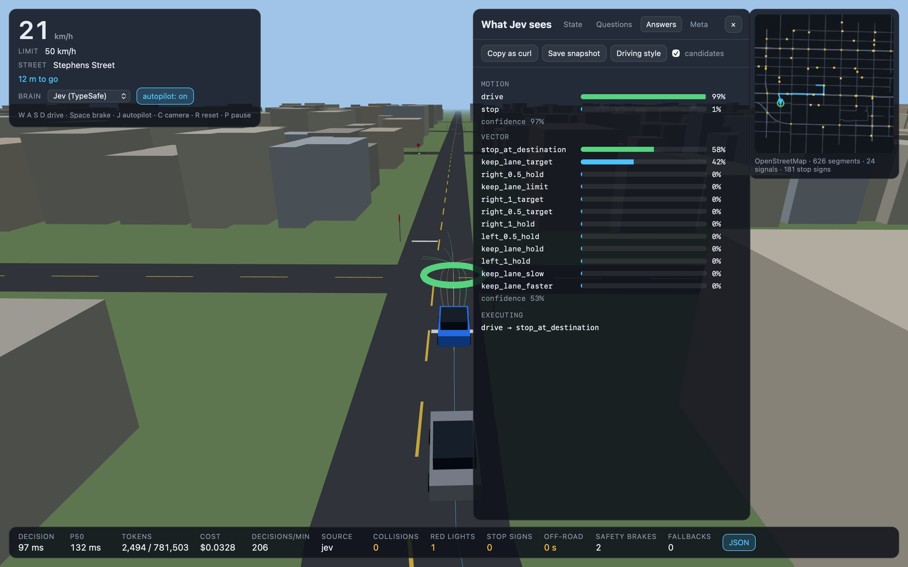

# Jev FSD

A driving simulator on real city streets where an AI model drives the car, and you can watch it
think. The model is [Jev](https://typesafe.ai/) by TypeSafe AI, a "System One" model: it does not
write text, it answers typed questions with probabilities in about a tenth of a second. Click a
destination on the minimap and Jev drives there through traffic, stop signs, and lights, while a
panel shows exactly what it was asked and how sure it was.



Default map: Kitsilano, Vancouver, straight from OpenStreetMap. Any neighbourhood works.

## Try it

You need Python 3.9 or newer. That is all; the 3D scene loads Three.js from a CDN, so no Node,
no build step.

```sh
git clone <this repo> jev_fsd && cd jev_fsd
uv run server.py          # or: python3 server.py
```

Open http://127.0.0.1:8322 and click anywhere on the minimap.

**To let Jev drive you need a TypeSafe API key.** Jev is in early access; request one at
[console.typesafe.ai](https://console.typesafe.ai). Then:

```sh
cp .env.example .env      # put TYPESAFE_API_KEY=... in it, restart the server
```

Without a key the app still runs with the **Rules** brain, plain code that drives the same car
through the same harness. It is the fallback and the control group, not a fake Jev.

Keys: click the minimap to set a destination · `J` autopilot on/off · `W A S D` drive yourself ·
`Space` brake · `C` camera · `R` reset to the lane · `P` pause · `1` Jev, `2` Rules · **JSON** opens
the panel.

Requirements: a desktop browser with WebGL. Phones are not supported yet.

## How it decides

Jev is text-only and, by TypeSafe's own account, not a calculator. So the split is strict:
**code owns the math, Jev owns the judgment.**

Every 250 ms near anything interesting (an intersection, a car ahead, a turn) and every 650 ms on
open road:

1. **Sense.** Code projects the car onto the route and computes the situation: lane offset,
   the next traffic control and its state, the car ahead and the gap, nearby traffic in the car's
   frame, and a `target_speed` from the limit, curves, gaps, stop lines, and the destination.
2. **Sample.** Code proposes up to 16 maneuvers: hold the lane at several speeds, shift half a
   meter left or right, roll up to the stop line, stop at the destination, brake hard.
3. **Simulate.** Each maneuver runs 3 seconds forward with the real car model and controller
   against predicted traffic. Anything that collides, leaves the road, or crosses a red or an
   uncompleted stop line is rejected before Jev ever sees it.
4. **Ask.** The survivors and the situation go to Jev as one request with two questions:
   `motion` (drive or hold still, right now) and `vector` (which maneuver for the next second).
   Questions with one legal answer are answered locally and cost nothing.
5. **Execute.** The chosen maneuver keeps running until the next answer lands, so latency never
   stalls the car. A local safety brake overrides for imminent collisions only. It never
   intervenes for lights or signs; those mistakes are counted on screen, not hidden.

### What Jev actually sees

A real decision, saved from a drive (`data/snapshots/red_light.json`), trimmed:

```json
{
  "driving_style": "cautious city driver: obeys limits, stops fully at stop signs, keeps a safe gap, ...",
  "car": {"speed": 0.7, "limit": 13.9, "target_speed": 0, "target_reason": "red light", "speed_vs_target": "above target"},
  "nav": {"next_turn": "left", "turn_in_m": 313.9, "remaining_m": 414, "turn_street": "Stephens Street"},
  "road": {"name": "West Broadway", "on_road": true, "lane_position": "centered"},
  "intersection": {"control": "signal", "signal": "red", "bumper_to_line_m": 5.9, "distance": "at", "entered": false},
  "candidates": [
    {"id": "keep_lane_hold", "steer": "hold lane",          "speed": "keep 0.7",   "vs_target": "above target", "progress_m": 2.1, "outcome": "clear"},
    {"id": "keep_lane_stop", "steer": "hold lane",          "speed": "stop",       "vs_target": "at target",    "progress_m": 0.4, "outcome": "clear"},
    {"id": "left_0.5_hold",  "steer": "shift 0.5 m left",   "speed": "keep 0.7",   "vs_target": "above target", "progress_m": 2.1, "outcome": "clear"},
    {"id": "hard_brake",     "steer": "hold lane",          "speed": "brake hard", "vs_target": "at target",    "progress_m": 0.1, "outcome": "clear"}
  ],
  "rejected": {"runs_red": 3}
}
```

The three maneuvers that would have crossed the line never reached Jev; code rejected them.

The `motion` question, with the situation clauses code chose to include:

> You are the driving policy of a car in city traffic. Obey traffic controls and drive as described
> in `driving_style`. The car is at the line and the signal is red: hold still until it turns green.
> Decide whether the car should keep moving or hold still right now.
>
> **drive**: Keep moving: cruising, slowing down, or rolling up to a stop line that is not reached
> yet all count as driving. Correct whenever the line, obstacle, or destination is still ahead.
> **stop**: Hold completely still right now. Correct only when the car is already at the line with
> a red light or a stop not yet completed, when the path directly ahead is blocked, or when the car
> has reached the destination.

Jev's answer, live: `motion = stop` at 100%, `vector = keep_lane_stop` at 99%, in 100 ms, for
$0.00006. Twenty meters earlier the same questions get `drive` at 100% and `stop_at_line` at 95%.

Wording is code. When the `stop` option was described as "a stop sign not yet completed", Jev
halted 47 m before the sign and waited. Say *when* an option is correct, and it drives.

## Measured

One 755 m drive in Kitsilano with 40 traffic cars, a stop sign, and three signals:

| | Jev brain |
|---|---|
| live decisions | 431 in 129 s |
| latency, median / 90th percentile | 130 ms / 199 ms |
| input tokens per decision | about 1,800 |
| cost for the drive | $0.033 (input tokens only; Jev's output is free) |
| collisions / stop signs missed | 0 / 0 |
| red lights | 1, entered as yellow turned red |

One run, one route. The point is the order of magnitude: hundreds of real model decisions per
minute for a few cents.

## Your own neighbourhood

```sh
JEV_FSD_BBOX="-123.1120,49.2570,-123.0940,49.2680" uv run server.py   # W,S,E,N in degrees
uv run scripts/fetch_map.py -123.1120,49.2570,-123.0940,49.2680     # or pre-build the map first
```

Keep it neighbourhood-sized: under 0.25 square degrees (the OpenStreetMap API limit), and
roughly 1 to 2 km across for a smooth frame rate. The first build fetches from the OpenStreetMap
API (Overpass mirrors as fallback) and caches under `data/maps/`. The Kitsilano pack is committed,
so the default runs offline. Two presets: `kitsilano`, `mount_pleasant`.

## Known limitations

- Signal timing is invented in code (48 s cycles); OpenStreetMap has no timing data.
- No pedestrians, no cyclists, no parked cars. Traffic cars follow lanes with a simple car-following
  model and never change lanes.
- One-way streets, turn restrictions and lane counts come from OpenStreetMap tags and are only as
  good as the tags. Roundabouts and complex junctions are handled crudely.
- The safety brake only covers collisions, on purpose, so the brain's mistakes are visible.
- Everything runs on `127.0.0.1`. This is a local demo, not a hosted service yet.

## Tests

```sh
uv run python -m unittest discover tests    # offline: geometry, road graph, controls, routing, proxy
open http://127.0.0.1:8322/tests            # browser: car model, controller, collisions, candidates, state
uv run scripts/verify_jev.py                # live: saved decisions in data/snapshots/ against the real model
```

The snapshots are real decisions saved from the panel's "Save snapshot" button, each with an
expectation such as "at a red light, `motion = stop` with p > 0.5". Run them after touching any
question wording; the offline tests cannot tell you whether Jev still understands you.

## Troubleshooting

- **"Could not listen on 127.0.0.1:8322"**: another server is running. `PORT=8400 uv run server.py`.
- **Blank page or "Failed to start"**: the browser needs WebGL and access to cdn.jsdelivr.net for
  Three.js. Check the browser console.
- **"no API key: Jev brain unavailable"**: put `TYPESAFE_API_KEY` in `.env` and restart.
- **"This server run has spent its $1.00 budget"**: the per-run spend guard. Restart with
  `JEV_FSD_BUDGET_USD=5`.
- **Map fetch fails**: the app falls back to a synthetic grid and says so in the minimap note.
  Try `uv run scripts/fetch_map.py` again later, or a smaller box.

## Layout

```
server.py            /api/status /api/map /api/route /api/decide /api/snapshot/save
jev/client.py        the only module that talks to TypeSafe (spend guard, latency, trace)
jev/osm/             fetch → parse → project → road graph → controls → buildings → map pack
jev/routing.py       edge-based A* with turn penalties, alternatives, rounded corners
static/js/sim/       car model, controller, collisions, signals, traffic, world
static/js/brain/     sensors, candidates, state + questions, scheduler, rules brain, jev brain, safety
static/js/render/    scene, roads, buildings, cars, overlays, minimap
```

## Credits

Map data © [OpenStreetMap](https://www.openstreetmap.org/copyright) contributors, ODbL.
Independent open-source demo, not affiliated with TypeSafe AI. Inspired by
[JevPilot](https://github.com/standardagents/jevpilot). MIT license.
