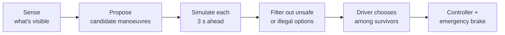

# Jev Drive Lab

**A driving simulator on real Canadian streets. Take on the same challenge as an AI driver, then
rewind and see why it made every choice.**

[**▶ Play it in your browser**](https://brendanh18.github.io/jev_fsd/) — no install, no account, no API key.


---

## Why this exists

Most self-driving demos ask you to trust a video. This one hands you the wheel.

Jev Drive Lab builds real neighbourhoods from OpenStreetMap: the roads, lanes, stop signs, traffic
lights and buildings. It lines the kerbs with parked cars and fills the streets with traffic,
cyclists and people on foot. Then
it lets you drive them yourself, or watch an AI driver do it. Every decision the AI makes is
recorded. You can pause the drive, scrub back to the moment a car door swung open, and see what the
driver could see, what it considered, and why it rejected each alternative.

It's part game, part teaching tool and part test bench for driving agents. The public demo runs
entirely in your browser.

> This is a research simulator. It is not, and is not meant to become, software for controlling a
> real vehicle.

## What you can do

### 🚗 Drive real neighbourhoods

Eight neighbourhoods across seven Canadian cities ship with the project, so the app works offline
once its dependencies are installed:

| Neighbourhood | City | | Neighbourhood | City |
|---|---|---|---|---|
| Kitsilano | Vancouver | | The Annex | Toronto |
| Mount Pleasant | Vancouver | | Le Plateau | Montréal |
| Old Town | Victoria | | Centretown | Ottawa |
| Beltline | Calgary | | Saint-Roch | Québec City |

Pick from six vehicles, including a city hatch, a sport coupe and a utility pickup. Each one has
its own dimensions, mass, power and handling. Then choose a paint colour, the weather (dry, rain,
fog or snow) and any time of day. The sun follows each city's real latitude, and street lights come
on at dusk.

### 🏁 Take on the challenges

Six hand-built scenarios test the situations real drivers get wrong:

| Challenge | Where | What it tests |
|---|---|---|
| **The door zone** | Kitsilano, afternoon | A parked car's door opens beside a cyclist |
| **Into the unknown** | Victoria, fog | A junction you can't see across |
| **Rain check** | Montréal, rainy night | A pedestrian crossing in poor light |
| **Winter composure** | Toronto, snow | A full stop on slippery roads |
| **Joining the flow** | Kitsilano | A car pulling out of a parking spot |
| **Around the corner** | Kitsilano | Someone stepping out from behind a building |

Drive them yourself, or set Rules, Jev or your own agent loose on the same seed and compare
results. A pass means you arrived with no collision, no red light or stop sign run, no failure to
yield, and less than a second off the road. A good coaching score on its own doesn't count.

### 🧠 See through the AI's eyes

Turn on **AI eyes** to see what the driver actually perceives. It shows which hazards are
visible, which ones buildings are hiding, how far it can see in the fog, the trajectories it
predicts for other road users, and the reason each candidate manoeuvre was rejected.


### ⏪ Rewind and try a different decision

The last two minutes of every drive are recorded. Scrub back, jump to the moment before an
incident, take over manually, switch to a different driver, or force one of the other manoeuvres
the AI considered. Then see how it plays out.

### 📸 Photo mode and the cinematic camera

Press **O** to freeze the world and step out of the car. The HUD disappears. You can orbit freely,
or let the cinematic director frame the shot, then adjust exposure, contrast, saturation, vignette
and even the time of day. **Save photo** downloads a clean PNG.

The **cinematic** camera (press **C** to cycle to it) works like a car film director. It cuts
between a roadside camera the car sweeps past, a low bumper chase, a slow helicopter orbit, a
tracking shot from ahead and a wheel-height side profile.

### 🤖 Bring your own driver

Write a small JavaScript module with a `decide()` function, load it in **Settings**, and it drives
under the same physics, sensing and safety checks as the built-in drivers. The
[arena](http://127.0.0.1:8322/arena) runs the fixed challenge suite and compares safety, comfort,
latency and cost. It saves evaluations and lets you diff a run against a previous baseline. See the
[agent guide](docs/agents.md) for a starter template.

## Quick start

The fastest way to try it is the [browser demo](https://brendanh18.github.io/jev_fsd/). To run it
locally with the full feature set, install [uv](https://docs.astral.sh/uv/) and run:

```sh
git clone https://github.com/BrendanH18/jev_fsd
cd jev_fsd
uv run server.py
```

Open **<http://127.0.0.1:8322>** in a desktop browser with WebGL. There is no frontend build step.
Python 3.10+ is all you need, and uv fetches a suitable version if you don't have one.

### Controls

| Key | Action | | Key | Action |
|---|---|---|---|---|
| `W A S D` / arrows | Drive (and take over from autopilot) | | `C` | Cycle cameras |
| `Space` | Brake hard | | `O` | Photo mode |
| `J` | Toggle autopilot | | Drag / scroll | Orbit and zoom the 360° camera |
| `Q` / `E` | Left / right indicator | | `P` | Pause |
| `H` | Horn (with sound on) | | `R` | Reset to the lane |
| `1` / `2` | Jev / Rules driver | | `?` | Show every shortcut |

Click the minimap to set a destination, or open **Explore cities** for suggested drives. If keys
stop responding after you use a menu, click the road view to give it focus again.

### Enabling the Jev model (optional)

The free **Rules** driver and the cautious starter agent work out of the box. **Jev** is an
LLM-backed driver served by [TypeSafe](https://console.typesafe.ai). To try it:

```sh
cp .env.example .env
# then set TYPESAFE_API_KEY=... in .env and restart the server
```

Your key stays on the local server and is never sent to the browser. A spend cap
(`JEV_FSD_BUDGET_USD`, $1 per run by default) and a request-rate cap (`JEV_FSD_RPM`) limit live
model calls. This project is independent and not affiliated with TypeSafe AI.

## How the AI drives

Every driver, whether it's Rules, Jev or yours, goes through the same loop for every decision:


```mermaid
flowchart LR
    A[Sense<br/>what's visible] --> B[Propose<br/>candidate manoeuvres]
    B --> C[Simulate each<br/>3 s ahead]
    C --> D[Filter out unsafe<br/>or illegal options]
    D --> E[Driver chooses<br/>among survivors]
    E --> F[Controller +<br/>emergency brake]
```

Sensing is honest. Buildings block line of sight, fog and darkness shorten it, and traffic lights
you can't see are treated as unknown. Every driver shares the physics, the controller and the
emergency brake, so differences in results come from decision-making alone.

## Graphics

The renderer uses [Three.js](https://threejs.org) with no build step and a vendored runtime. In
**Settings → Graphics** you can choose:

- **Low**: direct rendering, for older laptops.
- **High** (default): bloom, SMAA anti-aliasing, wet-road reflections and a cinematic colour grade.
- **Ultra**: adds ground-truth ambient occlusion, 4K shadow maps and up to 2× pixel ratio.

The sky is fully procedural. It has a physically placed sun and moon, stars, and a drifting cloud
deck lit from the sun's side. The clouds follow the weather, glow orange at dusk, pick up the
city's light at night, and show up in reflections on wet roads and car paint. Snow settles on
upward-facing surfaces, and rain darkens and polishes the asphalt.

## Development

```sh
uv run python -m unittest discover tests        # server, routing, maps, OSM pipeline
node scripts/test_drive_lab.mjs                 # drive lab and replay features
node scripts/test_arena_history.mjs             # saved evaluations and comparisons
node scripts/test_cinematic_photo.mjs           # cinematic camera and photo mode
node scripts/test_drive_score.mjs               # coaching score
python3 scripts/build_demo.py                   # build the static GitHub Pages demo
```

Every `scripts/test_*.mjs` file is a standalone Node check. Node 22 or newer runs them directly; CI passes `--experimental-default-type=module` too.
The [full reference](docs/project-reference.md#development) lists them all, along with the
optional Playwright browser check. CI runs the Drive Lab and arena checks on every pull request,
then builds and deploys the Pages demo from `main`.

```
server.py          local HTTP server and API (stdlib only)
jev/               map fetching, OSM processing, routing, model client
static/js/sim/     physics, traffic, pedestrians, signals, scoring
static/js/brain/   sensing, candidate generation, safety filter, drivers
static/js/render/  Three.js scene, sky, weather, cars, buildings, cameras
static/js/lab/     challenges, recorder, replay, arena
data/maps/         bundled neighbourhood map packs
```

If you change physics, sensing or planning, run a seeded comparison on `/bench` before and after.
Contributions are welcome. Agents, new scenarios, accessibility fixes and neighbourhood details
are especially appreciated.

## Further reading

- [Drive lab, perception and replay](docs/drive-lab.md)
- [Writing your own agent](docs/agents.md)
- [Scoring formula and driving details](docs/drive-experience.md)
- [Maps, attribution and custom extracts](docs/maps.md)
- [Rendering measurements](docs/render-performance.md)
- [Browser demo build and deployment](docs/browser-demo.md)
- [Full project reference](docs/project-reference.md)
- [Changelog](CHANGELOG.md)

## Credits

Map data © [OpenStreetMap contributors](https://www.openstreetmap.org/copyright), available under
the [ODbL](https://opendatacommons.org/licenses/odbl/1-0/). Rendering by
[Three.js](https://threejs.org) (MIT). Inspired by
[JevPilot](https://github.com/standardagents/jevpilot).

Released under the [MIT License](LICENSE).
