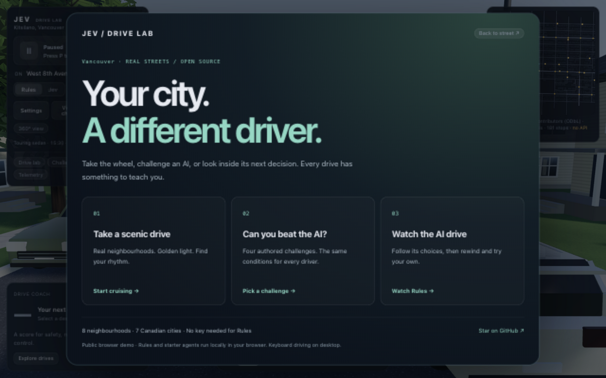
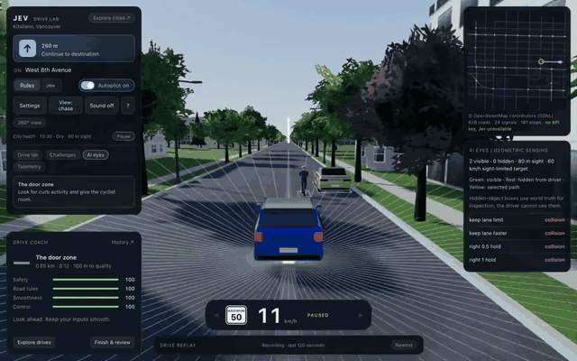

# Jev FSD · Drive Lab

**Can you drive Canadian streets better than an AI? Try the same challenge—and inspect every decision.**

An open-source driving simulator on real OpenStreetMap streets. Take the wheel, watch an AI
choose its next move, then rewind and try a different decision. Eight neighbourhoods across
seven Canadian cities, right in your browser.

[**Try the browser demo →**](https://brendanh18.github.io/jev_fsd/) ·
[Agent adapters](docs/agents.md) · [Drive lab guide](docs/drive-lab.md) ·
[Full project reference](docs/project-reference.md)





## Pick your drive

- **Can you beat the AI?** Six fixed challenges: an opening car door beside a cyclist,
  a foggy junction, a rainy-night crossing, a full stop in snow, a car merging from parking,
  and a person emerging from behind a building. Drive manually or compare
  Rules, Jev and your own agent under the same conditions.
- **See through the AI's eyes.** Inspect visible hazards, building occlusion, sight limits,
  predicted trajectories and candidate rejection reasons.
- **Rewind your drive.** Review the last two minutes, jump back before an incident, take over,
  switch drivers or try another eligible manoeuvre. Playback interpolates recorded checkpoints.
- **Share the result.** Export a score card and copy a link that recreates the challenge setup.
- **Bring your own driver.** Load a JavaScript agent, run the fixed evaluation suite and compare
  safety outcomes, comfort, latency and cost. Save evaluations, import a previous baseline,
  and inspect incident timelines with recorded decisions. Export versioned results.
- **Just cruise.** Choose a neighbourhood, a car and a camera. Turn on sound, watch the daylight
  change, or take a scenic drive in golden light.

The public demo runs the free Rules and starter agents without installation or an API key.
Jev uses a server-side TypeSafe key in the local app. This independent project is not affiliated
with TypeSafe AI. It is a research simulator, not a system for controlling a real vehicle.

## Run locally

Install [uv](https://docs.astral.sh/uv/), then:

```sh
git clone https://github.com/BrendanH18/jev_fsd
cd jev_fsd
uv run server.py
```

Open [localhost:8322](http://127.0.0.1:8322). No frontend build step. Bundled maps and Three.js
let Rules driving run without external network access after Python dependencies are installed.

**WASD / arrows** drive and take over · **J** toggles autopilot · **P** pauses · **C** changes
camera · **?** opens keyboard help. Use a desktop browser with WebGL and a keyboard.

To enable Jev, copy `.env.example` to `.env`, set `TYPESAFE_API_KEY` from the
[TypeSafe console](https://console.typesafe.ai), and restart. The key stays on the local server;
spend and request-rate guards cap live model calls.

## How the driver works

Every decision senses the visible world, proposes manoeuvres, simulates them three seconds
ahead, and filters unsafe or illegal options. Rules, Jev or your adapter chooses among the
survivors. They share physics, sensing, the controller and an emergency brake.

Coaching scores measure safety, road rules, smoothness and control. Evaluation passes require
arrival with no audited collision, red light, missed stop or failed yield, and less than one
second off-road. A high coaching score alone is not an evaluation pass.

Open [/arena](http://127.0.0.1:8322/arena) for the six authored challenges or
[/bench](http://127.0.0.1:8322/bench) for seeded city routes. Rules and the cautious starter
passed all six authored challenges in the recorded local checks. These individual runs do
not guarantee performance across every map, seed or live model response.

## Build, contribute and explore

```sh
uv run python -m unittest discover tests
node scripts/test_drive_lab.mjs
node scripts/test_arena_history.mjs
node scripts/test_drive_score.mjs
node scripts/test_vehicle_models.mjs
python3 scripts/build_demo.py
```

CI on pull requests runs the Drive Lab and arena history checks, then builds the GitHub Pages
demo. The [agent guide](docs/agents.md) includes a starter adapter and the evaluation contract.
The [full reference](docs/project-reference.md#development) lists the simulation, rendering
and scoring checks. Run seeded comparisons after changes to physics, sensing or planning.
Contributions to agents, scenarios, accessibility and neighbourhood details are welcome.

- [Drive lab, perception and replay](docs/drive-lab.md)
- [GitHub Pages build and deployment](docs/browser-demo.md)
- [Maps, attribution and custom extracts](docs/maps.md)
- [Scoring formula and controls](docs/drive-experience.md)
- [Rendering measurements](docs/render-performance.md)
- [Release history](CHANGELOG.md)

## Credits and license

Map data © [OpenStreetMap contributors](https://www.openstreetmap.org/copyright),
[ODbL](https://opendatacommons.org/licenses/odbl/1-0/). Rendering by Three.js (MIT).
Inspired by [JevPilot](https://github.com/standardagents/jevpilot).
Released under the [MIT License](LICENSE).
