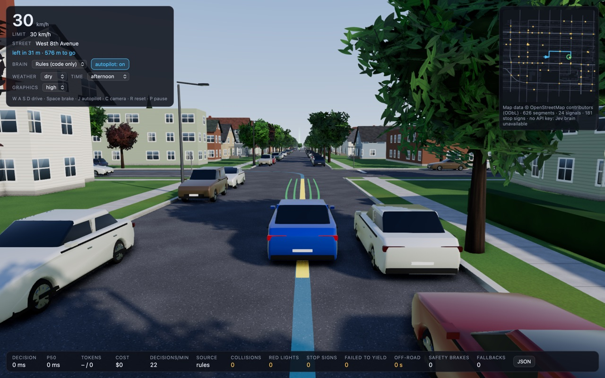
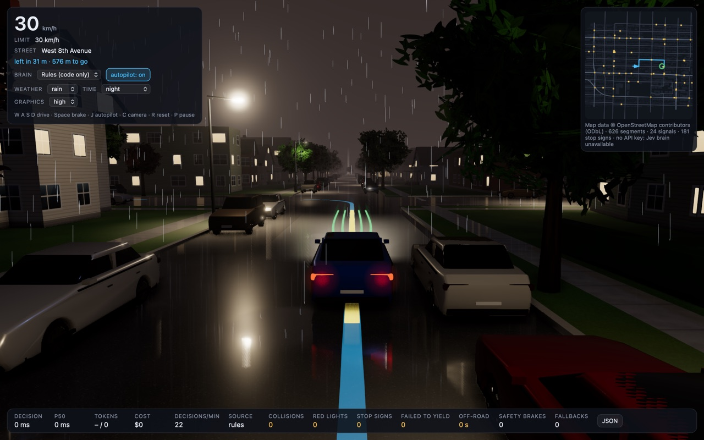
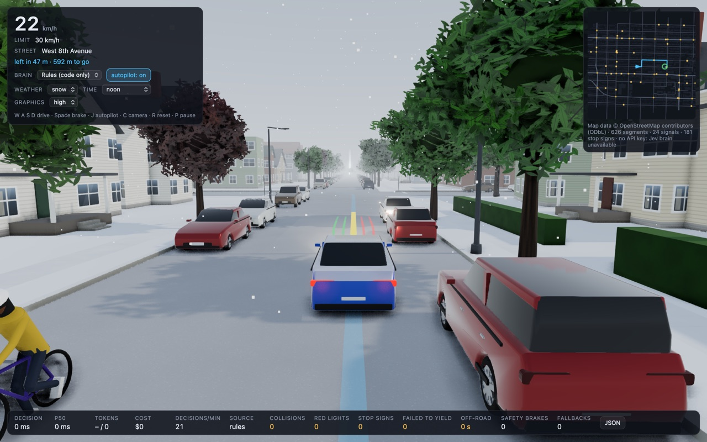
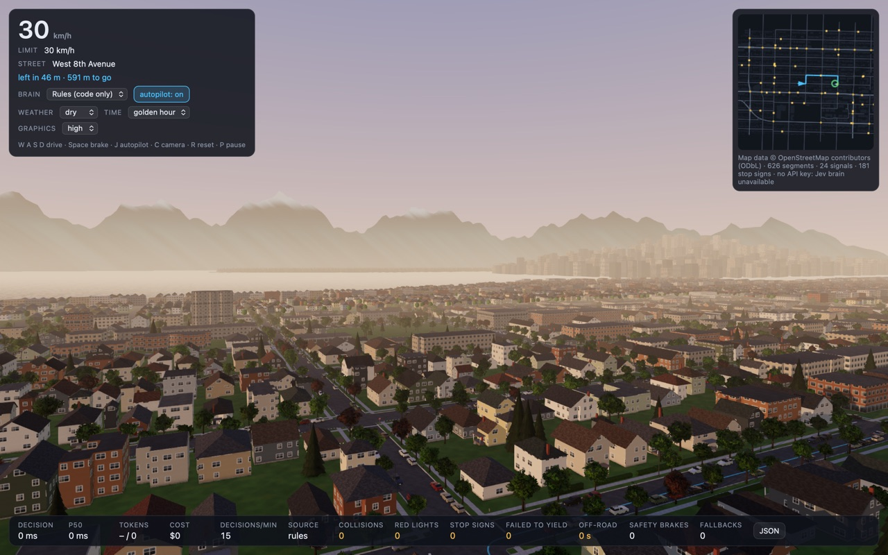
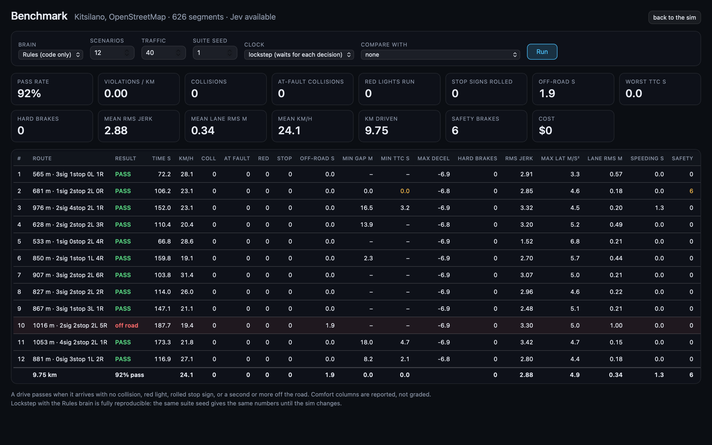

# Jev FSD

**Watch an AI model drive through a real city, and see every decision it makes.**

Jev FSD is a driving simulator on real [OpenStreetMap](https://www.openstreetmap.org/) streets,
Kitsilano in Vancouver by default, with bundled neighbourhoods in **Victoria, Toronto and Montréal**.
Choose **Explore cities** for a suggested drive, or click a destination on the minimap and the car drives there
through traffic, stop signs, traffic lights, cyclists, pedestrians, parking cars, and opening
doors, in any weather and at any time of day. The driver is [Jev](https://typesafe.ai/), a
"System One" model from TypeSafe AI: instead of writing text, it answers typed multiple-choice
questions with probabilities, in about a tenth of a second. A panel shows exactly what it was
asked, what it answered, how sure it was, and what that cost.



> **A research and demo project.** It explores how a fast classification model can make driving
> decisions in a simulation. It is not a self-driving system and must never be used to control a
> real vehicle. It is independent and not affiliated with TypeSafe AI.

## New: a drive worth improving

- **Four Canadian cities.** Switch between Vancouver's Kitsilano, Victoria's Old Town, Toronto's
  Annex and Montréal's Plateau. All four map packs are included and work without downloading a map.
- **Three drives from wherever you are.** A neighbourhood cruise, a junction-focused route and a
  longer tour, all routed through the selected city's actual street graph.
- **A live drive coach.** Safety, road rules, smoothness and control contribute to a score out of
  100. Complete a route or choose **Finish & review** for a grade, deductions and coaching tips.
  Your last 20 drives stay on this device; reports export as JSON. Manual and autopilot drives
  use the same measurements. Pauses and waiting at lights carry no penalty.
- **More of the driving feel.** Readable street names and speed-limit signs, gentler keyboard
  steering, interpolated vehicle motion, manual indicators and a speed warning. Hood view adds
  rain beads, sweeping wipers and optional camera motion; optional sound adds motor, road, rain,
  indicator clicks and a horn.

Start with **Explore cities → Victoria → Neighbourhood cruise**, or press `W` to drive yourself.
Use **View** or `C` for the hood camera and **Sound off** to enable audio.
See [drive scoring and controls](docs/drive-experience.md) and [map data](docs/maps.md).

## Driving realism: a car that can't see everything

Until now the car knew the whole world: every car behind every house, every signal phase a block
away, every pedestrian in thick fog. This release takes that away and makes the street busier.

| | Before (0.2.0) | Now |
|---|---|---|
| **Line of sight** | perfect; fog and night changed only the picture | building footprints block the view of traffic, pedestrians, and signals |
| **Sensing range** | unlimited | 80 m dry, 55 m rain, 40 m snow, 28 m fog |
| **Signals out of sight** | phase always known | `unknown`, treated as a stop until a permitted phase is seen |
| **Speed planning** | limit, curves, and traffic | also limited to stopping within the road it can actually see; blind bends are taken at a walking pace |
| **Predictions and safety brake** | used every object in the world | use only what the car has observed; collisions still come from the full world |
| **Parking** | parked cars only ever left | traffic reserves an empty curb bay, indicates, slows, and pulls in; the same car becomes a parked obstacle |
| **Car doors** | never opened | parked cars open an animated street-side door for six seconds, with a matching collision shape that traffic, sensing, and prediction all respect |
| **Pull-outs** | left smaller gaps | leave more room for approaching traffic |
| **Jev's prompt** | "normally pick the centered candidate at target speed" | weigh progress, braking, cornering, clearance, roadside activity, and sight lines according to `driving_style` |
| **Candidates** | speed and progress | also peak acceleration, braking, cornering force, and closest side clearance, plus an earlier "cautious" slowdown |
| **Test cases for Jev** | 9 saved decisions | plus 11 committed cases built by the real pipeline: hidden traffic, fog, crossings, mid-block approach/hold/clear, cyclists, parking, pull-outs, open doors |

**What it costs.** The world is harder and the Rules driver shows it: on the same seeded suite it
now passes 10 of 12 drives in dry weather and 10 of 12 in fog (it was 12 of 12), at a lower mean
speed. Every route still arrives, and none of the three collisions is blamed solely on the driven
car. See [Benchmark](#benchmark) and the full [validation report](docs/realism-validation.md).

**What is not yet known.** The revised Jev prompt has only been checked offline. Whether Jev now
drives differently from Rules, and how `driving_style` changes that, needs a live benchmark with
an API key. See [CHANGELOG.md](CHANGELOG.md) for the full list.

## What you get

- **Real streets.** Lanes, speed limits, one-way streets, signals, stop signs, roundabouts, parking
  lanes, bike routes, and buildings, straight from OpenStreetMap. Any neighbourhood works.
- **A living street.** Forty drivers with their own temperaments who park, pull out, and open
  their doors; 3,200 parked cars; twelve cyclists; and sixty pedestrians who cross on the walk
  signal, or sometimes mid-block.
- **Honest sensing.** The car sees only what is in range and not hidden behind a building, so
  it has to slow for blind corners and fog, and an empty road ahead is never a promise.
- **Physics you can feel.** A tire-slip car model with weight transfer, power-limited acceleration,
  and drag. Rain, fog, and snow change the grip, and everyone drives more carefully.
- **Any time of day.** The sun follows its real path over Vancouver, from dawn to a night lit by
  street lights, headlights, and windows. The mountains, English Bay, and downtown sit on the
  horizon.
- **Two drivers, one car.** Switch between Jev and a hand-written Rules driver that run through the
  same pipeline, so you can compare them fairly.
- **Nothing hidden.** Copy any decision as a `curl` command or save it. Collisions, red lights,
  rolled stop signs, failures to yield, and time off the road are counted on screen.
- **A benchmark.** A reproducible suite of drives scores any driver on safety, comfort, lane
  keeping, legality, and cost.
- **No build step.** A small Python server and a browser. Three.js loads from a CDN.



## Quick start

You need [uv](https://docs.astral.sh/uv/) (it provides Python 3.10+ and the one dependency) and a
desktop browser with WebGL.

```sh
git clone https://github.com/BrendanH18/jev_fsd && cd jev_fsd
uv run server.py
```

Open http://127.0.0.1:8322 and click anywhere on the minimap.

**Without an API key** the app uses the Rules driver, which needs no account and costs nothing.
**To let Jev drive**, request a key at [console.typesafe.ai](https://console.typesafe.ai) (Jev is
in early access), then:

```sh
cp .env.example .env      # set TYPESAFE_API_KEY=... and restart the server
```

| Key or control | Action |
|---|---|
| click the minimap | set a destination (the autopilot starts) |
| `J` | autopilot on / off |
| `W A S D` or arrows | drive yourself (takes over from the autopilot) |
| `Space` | brake hard |
| `Q` / `E` / `H` | left indicator / right indicator / horn (enable sound first) |
| `C` | camera: chase, hood, top-down, high chase |
| `R` / `P` | put the car back on the lane / pause |
| `1` / `2` | Jev driver / Rules driver |
| weather, time, graphics menus | or `?weather=rain`, `?time=night` (also `?time=17:45`), `?quality=low` in the URL |
| **JSON** button | open the decision panel |
| **Explore cities** / **Explore drives** | choose a Canadian city or a suggested route |
| **Finish & review** / **History** | grade the current drive / see saved reports |
| **Sound**, **wipers**, **motion** | optional audio and hood-view effects |

Three pages: `/` (the simulator), `/bench` (the benchmark), `/tests` (the browser tests).

## How a decision is made

Code owns the math and the physics; the model owns the judgment. Every 250 ms of simulated time
near anything interesting, and every 650 ms on open road:

1. **Sense.** Observe traffic, pedestrians, parked cars, and open doors within weather range and
   building sight lines; signal phases out of sight are `unknown`. Project the car onto its route
   and work out the situation, including a `target_speed` that accounts for the limit, weather, a
   lower limit ahead, the car in front, required stops, roundabouts, pedestrians, the destination,
   curves, and how much road is visible to stop in.
2. **Propose.** Up to 16 maneuvers: stay in the lane at several speeds (including a cautious
   three-quarters of target), shift half a meter or a meter to either side, roll up to a stop line,
   stop for a crossing pedestrian or the destination, or brake hard. Stopping options are kept
   first when a busy street offers many alternatives.
3. **Simulate.** Run each maneuver three seconds ahead with the real car model against the
   traffic the car has observed; hidden objects are not in these predictions. Record the peak
   acceleration, braking, cornering force, and side clearance. Reject any that collide, leave the
   road, run a red, an unseen signal, or an unfinished stop, fail to yield to a roundabout or a
   pedestrian, pass a cyclist with under a meter to spare, or go faster than the visible road
   allows stopping.
4. **Choose.** Jev or Rules picks among the survivors.
5. **Execute.** The chosen maneuver keeps running until the next decision arrives, so the car never
   waits for the network.

A local safety brake steps in for imminent collisions only, with the same visibility limits as
the driver. It never intervenes for lights or signs, so a driver's mistakes stay visible. The
collision and violation counters use the full world, so what the car could not see still counts.

### What Jev actually sees

A real decision saved from a drive (`data/snapshots/red_light.json`), shortened:

```json
{
  "driving_style": "cautious city driver: obeys limits, stops fully at stop signs, keeps a safe gap, ...",
  "car": {"speed": 0.7, "limit": 13.9, "target_speed": 0, "target_reason": "red light"},
  "intersection": {"control": "signal", "signal": "red", "bumper_to_line_m": 5.9, "distance": "at"},
  "candidates": [
    {"id": "keep_lane_hold", "steer": "hold lane", "speed": "keep 0.7",   "outcome": "clear"},
    {"id": "keep_lane_stop", "steer": "hold lane", "speed": "stop",       "outcome": "clear"},
    {"id": "hard_brake",     "steer": "hold lane", "speed": "brake hard", "outcome": "clear"}
  ],
  "rejected": {"runs_red": 3}
}
```

Three maneuvers that would have run the red were removed by code before Jev saw anything. Jev is
then asked up to two questions, `motion` (keep driving or hold still right now?) and `vector`
(which maneuver for the next second?), and answers each with a probability for every option. Here:
`motion = stop` at 100% and `vector = keep_lane_stop` at 99%, in 100 ms, for $0.00006.

**Wording matters.** When the `stop` option was described as "a stop sign not yet completed", Jev
stopped 47 m before the sign and waited. Describing *when* each option is correct fixed it.

## Jev mode and Rules mode

| | Jev | Rules |
|---|---|---|
| Who chooses | the Jev model, via TypeSafe's API | about 40 lines of JavaScript (`static/js/brain/rules.js`) |
| How | reads the situation, answers two questions with probabilities | adds up a fixed score per maneuver, takes the lowest |
| Needs | an API key and a network | nothing |
| Time per decision | about 130 ms (the car keeps executing its last choice) | effectively zero |
| Cost | about $0.00008 per decision | free |
| Repeatable | no | yes |
| Reads `driving_style` | yes, edit it in the panel | no |

Failures never stall the car: if Jev takes over 1.5 s, returns an invalid choice, or errors, the
Rules driver decides that step and the **fallbacks** counter goes up. Questions with a settled
answer (`motion` away from any hazard, `vector` with one survivor) are filled in locally and never
sent.

**What judgment is left for Jev.** Both drivers share sensing, safety filtering, and the
controller, so they will often agree. Earlier versions of the prompt told Jev to "normally pick the
centered candidate whose end speed is at target", which is exactly what the Rules score rewards.
The prompt now treats `target_speed` as a reference and asks Jev to weigh progress, braking,
cornering, clearance, roadside activity, and sight lines according to `driving_style`, with the
numbers to do it on each candidate. Rules keeps its fixed score. Whether that makes Jev drive
measurably differently is still to be benchmarked live, including with different driving styles.

## The simulation



- **The car.** A dynamic bicycle model: saturating tire forces shared between braking and
  cornering, weight transfer, yaw inertia, actuator lag, power-limited acceleration, drag, and
  rolling resistance. ABS and stability control keep hard braking in a bend stable on dry roads; on
  wet or snowy roads a bend taken too fast still slides. The same model drives every car and every
  prediction, so predictions match what really happens.
- **Traffic.** Cars follow their lanes with the Intelligent Driver Model, each driver with their
  own acceleration, braking, headway, and reaction time. They obey signals and signs, yield when
  turning left, at roundabouts, at uncontrolled junctions and crosswalks, wait for a gap at
  two-way stops, change lanes when the next lane is free, and back off from nose-to-nose standoffs.
- **Signals.** Each junction gets a timing plan worked out like an engineer would: yellow from the
  approach speed (the ITE formula), all-red to clear the junction, a 50 or 60 second cycle split by
  traffic, and a walk signal that gives way to a flashing hand.
- **Parking and doors.** Drivers reserve a vacant curb bay, indicate, slow down, and pull forward
  into it; the same car, in the same pose, becomes a parked obstacle. Parked cars sometimes open a
  street-side door for six seconds, or signal and wait for a gap before pulling out. The animated
  door panel is its own obstacle for sensing, prediction, and collisions, and traffic steers around
  it.
- **Cyclists and pedestrians.** Cyclists ride the bike routes on the right of the lane and need a
  meter of room to pass. Pedestrians cross on the walk signal or when nothing is coming, sometimes
  mid-block, hurry out of the way of a car that will not stop, and open umbrellas in the rain.
- **Sensing.** Building footprints block line of sight. Detection range is 80 m in dry weather,
  55 m in rain, 40 m in snow, and 28 m in fog. Speed planning and candidate filtering keep the car
  able to stop within the road it can see, so blind bends are taken at a walking pace until the
  road opens up. Mapped stop signs and signals are always known, but a signal's phase only when it
  is in view.
- **Weather and time.** Dry, rain, fog, or snow set the grip and how carefully everyone drives;
  the scene shows an overcast sky, mirror-wet roads, falling rain or snow, and snow settling on
  roofs and lawns. The sun's position is worked out for Vancouver in late September.
- **The scene.** All generated in code, with no downloaded assets: ambient occlusion, bloom, and
  antialiasing; textured roads and curbs; swaying trees; houses with porches and chimneys; street
  lights; people and cyclists who walk and pedal. Beyond the map the city continues to English
  Bay, the downtown skyline, Stanley Park, and the North Shore mountains.



## Benchmark



`/bench` scores a driver on a fixed, seeded suite of drives, run without graphics through the same
world, traffic, and autopilot you watch. *Lockstep* mode pauses the world while a decision is
pending (pure decision quality; identical every run for Rules), and *realtime* keeps it moving so
model latency counts. Runs are saved to `data/runs/`, compared side by side, and replayed in 3D.

A drive **passes** if it arrives with no collision, red light, rolled stop, or failure to yield,
and under a second off the road. The page also reports fault, closest gap, time to collision,
safety brakes, jerk, cornering force, lane keeping, speeding, decisions, tokens, cost, and latency.

**Rules, 12 drives, seed 1, 40 traffic cars, lockstep** (2026-09-29, this version against 0.2.0):

| | 0.2.0, dry | now, dry | now, fog |
|---|---:|---:|---:|
| Passed | 12/12 | 10/12 | 10/12 |
| Arrived | 12/12 | 12/12 | 12/12 |
| Collisions (blamed on the driven car) | 0 | 2 (0) | 1 (0) |
| Red lights / rolled stops / failures to yield | 0 / 0 / 0 | 0 / 0 / 0 | 0 / 0 / 0 |
| Time off the road | 0.1 s | 0.2 s | 1.4 s |
| Safety brakes | 7 | 9 | 5 |
| Mean speed | 24.5 km/h | 22.0 km/h | 17.1 km/h |

Any collision fails a drive, whoever is at fault. The dry failures are crossing traffic (shared
fault) and an oncoming car hitting the stopped driven car; in fog, a pull-out contact and 1.4 s off
the road. Parking, doors, and the new traffic recovery change how the seeded traffic develops, so
this compares worlds as well as drivers. Rain and snow have not been rerun; in 0.2.0 the suite
passed 12 of 12 in rain (22 km/h), fog (22), and snow (17). The runs are in
[`docs/validation/`](docs/validation/) and `data/runs/20260928-222541-rules.json`; choose them
under **compare with**. Details in [the validation report](docs/realism-validation.md).

A Jev run of the suite is about 4,900 decisions, roughly $0.40. Jev has not yet been run in this
version of the world.

One 755 m drive recorded with Jev on 2026-09-18 (an earlier car model): 431 decisions in 129 s,
130 ms median latency, about 1,800 input tokens per decision, $0.033 in total, no collisions, and
one red light entered as it turned from yellow to red. One drive on one route; the benchmark is the
way to get comparable numbers.

## Your own neighbourhood

```sh
JEV_FSD_BBOX="-123.1120,49.2570,-123.0940,49.2680" uv run server.py    # west, south, east, north
uv run scripts/fetch_map.py mount_pleasant                               # or build one ahead of time
```

The bundled city picker needs no configuration; `?map=victoria`, `?map=toronto` and
`?map=montreal` also select a city directly. Keep custom areas neighbourhood-sized: under
0.25 square degrees and roughly 1 to 2 km across. The first run
downloads and caches the map in `data/maps/`; Kitsilano is included, so the default works offline.
If a download fails the app uses a synthetic grid and says so. Vancouver's water, downtown, and
mountains appear on any map of Vancouver; elsewhere you get the surrounding city but no landmarks.

| Setting (in `.env` or the environment) | Default | Meaning |
|---|---|---|
| `TYPESAFE_API_KEY` | none | enables Jev mode |
| `JEV_FSD_BUDGET_USD` | `1.00` | stop live Jev calls after this much spend in one server run |
| `JEV_FSD_RPM` | `240` | maximum live Jev calls per minute |
| `JEV_FSD_NPCS` | `40` | number of traffic cars |
| `JEV_FSD_BBOX` | Kitsilano | map area, as `W,S,E,N` or a preset name |
| `PORT` | `8322` | server port |
| `TYPESAFE_DEFAULT_MODEL`, `TYPESAFE_BASE_URL` | SDK defaults | model and API endpoint |

## Security and privacy

- **Your API key stays on the server.** The browser never receives it.
- **The server listens only on `127.0.0.1`** and refuses requests from other websites (host
  allow-list, fetch metadata, origin checks, a per-session token, JSON-only bodies), so a page you
  visit cannot drive it or spend your credits.
- **Spending is capped** by a per-run budget and a rate limit.
- **What is sent to TypeSafe** is the decision state and questions shown in the panel: distances,
  speeds, street names, and maneuver descriptions in the car's own frame. No map coordinates and
  nothing about you.

## Limitations

- Traffic never overtakes cyclists, and the driven car never changes lanes (half- and one-meter
  shifts only).
- Parking uses forward pull-ins into larger empty gaps, rather than reverse parallel parking.
  Pedestrians never cross against a signal.
- One-way streets, turn restrictions, and lane counts are only as good as the OpenStreetMap tags.
- The car model has no suspension or road camber. Sensing uses deterministic building footprints
  and weather ranges, with no sensor noise or object tracking; trees and other vehicles do not
  occlude objects, and darkness does not yet reduce detection range.
- The revised Jev prompt has not been checked against the live model. The committed cases and
  offline checks prove the requests are well formed and match the app, not that Jev's answers are
  right; that needs an API key.
- The Rules driver no longer has a perfect benchmark: two of twelve drives fail in dry weather and
  two in fog.
- Everything beyond the map is scenery with simplified geography. It runs locally only.

## Development

```sh
uv run python -m unittest discover tests    # offline: geometry, road graph, controls, routing, API
open http://127.0.0.1:8322/tests            # browser: car model, controller, signals, traffic, planner
open http://127.0.0.1:8322/bench            # the benchmark
uv run scripts/verify_jev.py --offline      # validate committed cases and saved requests, no model calls
uv run scripts/verify_jev.py                # live: committed cases + data/snapshots/, requires API key
node --experimental-default-type=module scripts/build_jev_fixtures.mjs --check # fixture drift
```

For renderer profiling and distance-detail tests, see [Rendering performance](docs/render-performance.md).

Run the benchmark after changing the car, traffic, planner, or router, and the snapshot check after
changing any question wording. The committed Jev cases in `static/tests/fixtures/jev/` are built by
running the real sensing and question pipeline; rebuild them with
`node --experimental-default-type=module scripts/build_jev_fixtures.mjs` after changing either, and
`/tests` also compares each one with the current pipeline. `scripts/shot.swift` (macOS) drives a
page in an offscreen browser for screenshots and headless benchmark runs; see the header of the
file.

**Adding another driver.** Drivers live in `static/js/brain/` and expose
`decide(snap, eligible, request, signal)`, resolving to `{ motion, candidateId, meta }`. Register
it in the `Autopilot` constructor in `brain.js` and in the menus in `static/index.html` and
`static/bench.html`; the benchmark then scores it like any other.

```
server.py            local web server: pages, map, routing, the Jev proxy, benchmark storage
jev/                 Python: TypeSafe client and spend guard, request checks, settings
jev/osm/             OpenStreetMap download → road graph → controls → buildings → map pack
static/js/sim/       car model, controller, collisions, signals, traffic, parking, pedestrians, sight, world
static/js/brain/     sensing, maneuvers, questions for Jev, the Rules and Jev drivers, safety brake
static/js/bench/     benchmark suite, headless runner, metrics
static/js/render/    3D scene: sky, post-processing, streets, buildings, trees, cars, people, surroundings
scripts/             map pre-builder, Jev case builder and checker, headless screenshots
data/                maps, saved decisions, benchmark runs
docs/                screenshots, validation report and benchmark records
```

## Contributing

Issues and pull requests are welcome. Before opening one, run the Python and browser tests and a
Rules benchmark (seed 1), and include the comparison against the committed baseline if your change
affects driving. See [CHANGELOG.md](CHANGELOG.md) for what has changed.

## Credits and license

- Map data © [OpenStreetMap](https://www.openstreetmap.org/copyright) contributors, under the Open
  Database License (ODbL).
- 3D rendering by [Three.js](https://threejs.org/) (MIT).
- Jev and TypeSafe are products of TypeSafe AI; this project is independent and not affiliated with
  or endorsed by them.
- Inspired by [JevPilot](https://github.com/standardagents/jevpilot).

Released under the [MIT License](LICENSE).
